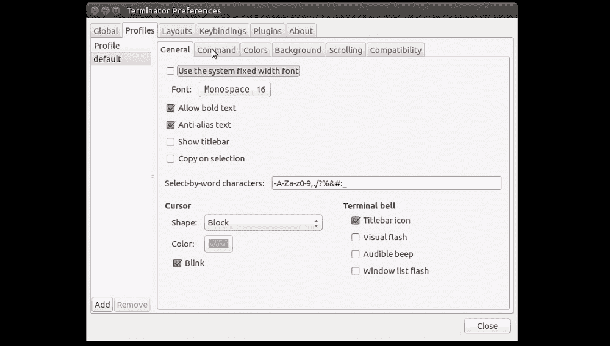
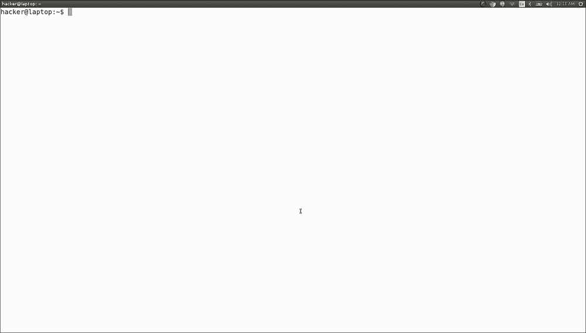
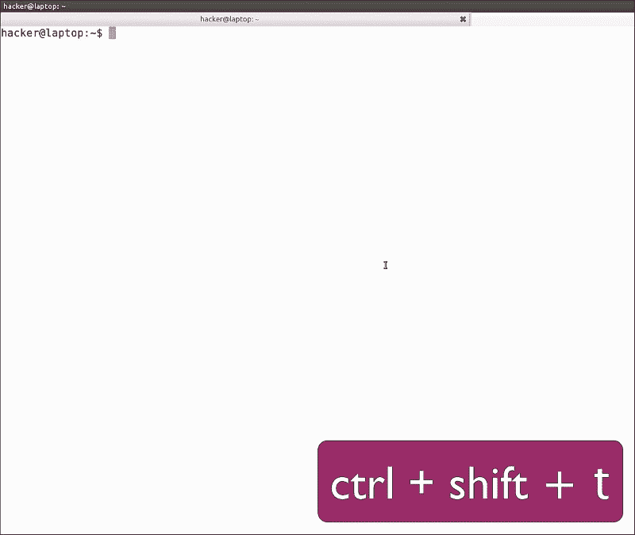
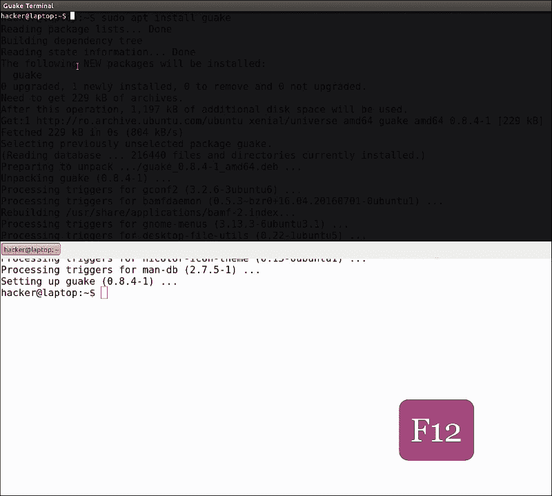
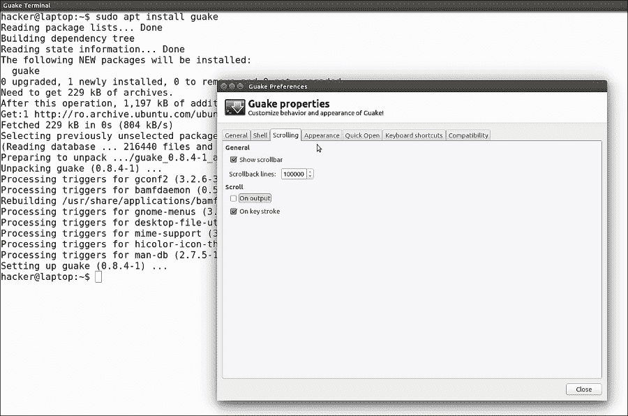
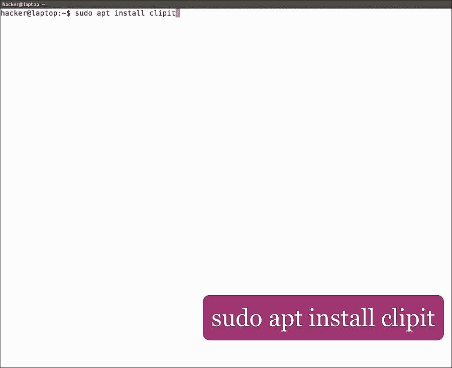
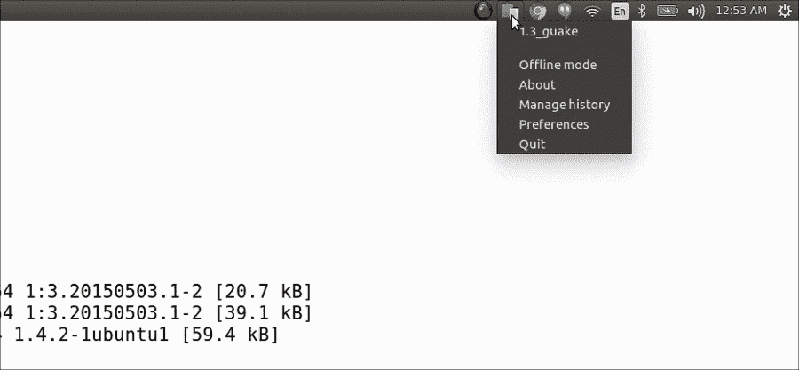
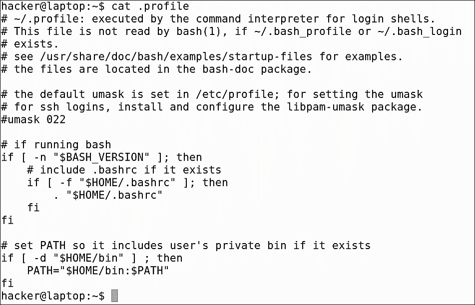
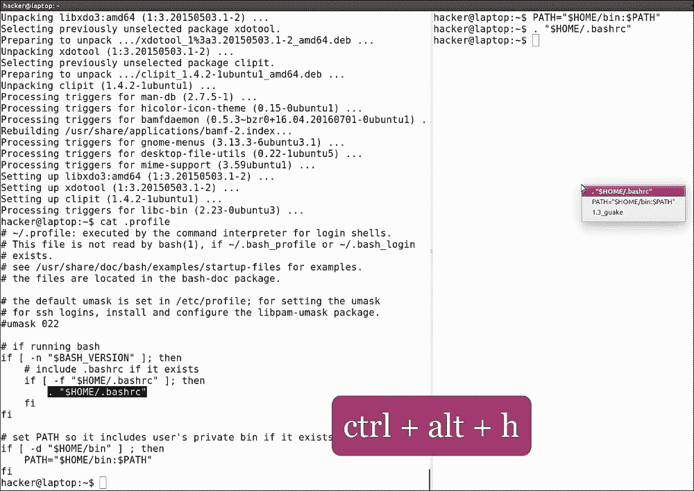

# 一、概述

这本书被分成多个部分。在第 1 部分中，我们将探索一个新的终端，并向您展示如何安装和配置它。在第 2 部分中，我们将专注于配置您的 shell、添加插件、理解正则表达式以及使用管道和子 shell。然后，一切都将凝结成一个 shell 脚本课程。在第 3 部分中，我们将使用我们推荐的编辑器 Vim。我们将涵盖一切，从配置它，学习键盘快捷键，安装插件，甚至使用它作为密码管理器。让我们开始吧。

在下一章中，我们将学习以下主题:

*   理解终结者的工作
*   使用 Guake 执行快速命令或长时间运行的任务
*   使用剪贴板复制粘贴文本

所以，我们将从一个终端开始，之后一切都将是疯狂的！当谈到在终端长时间工作时，我们的选择是使用终结者，因为它的快速和简单的分屏功能。然后，我们将重点关注 Guake，一个无论你在哪里都能快速打开的终端。最后，您将了解 Clipit 的工作原理，并有效地使用其复制和粘贴功能。

# 准备好了吗？

我们将深入探讨 Linux 环境，为您提供提高工作效率、让您更好地使用命令行以及自动化您的任务的提示和技巧。

本书基于 Ubuntu Linux 版本，这是最新的长期支持版本。我们选择 Ubuntu 是因为它是最常见的 Linux 发行版，使用起来非常简单，有很多图形工具，你可以找到一个庞大的在线社区来回答你的所有问题。Ubuntu 也是最受支持的 Linux 发行版。这意味着，那些创建软件，尤其是图形软件，并为 Linux 提供这些软件的公司，通常从 Ubuntu 开始。

这使得我们更容易使用工具，如 Skype、Slack 或 Visual Studio Code。虽然这本书是基于 Ubuntu 的，但大多数命令都与 Ubuntu 无关，所以你可以很容易地使用另一个发行版并应用相同的课程。这本书的很大一部分甚至可以适用于 Mac，因为我们可以在 Mac 上安装相同的工具——bash、zsh、vim 在 Linux 和 Mac 上都以相同的方式工作——随着 Windows 10 的发布，bash 支持被内置，因此可以轻松安装和使用 zsh 和 vim 等工具。在 Windows 10 之前，有 cygwin 这样的工具可以让你在 Windows 环境中使用 Linux 命令行。

我们建议您在开放的终端中阅读和练习，这样您就可以执行命令并检查它们的结果。在我们开始之前，您需要从我们的 GitHub 资源库(位于此处:[https://github.com/petruisfan/linux-for-developers](https://github.com/petruisfan/linux-for-developers))下载所有源文件。

# 终结者——终极终端

为了变得高效，你需要做的第一件事就是拥有一个好的终端。在整本书中，我们将主要使用命令行，这意味着我们将使用的主要软件是我们的终端。我们推荐的一款很棒的终端是**终结者**，可以从软件中心安装。

让我们去我们的启动器，点击软件中心图标。打开后，点击搜索输入，写出`terminator,`，如下图截图所示。它可能会是结果列表中的第一个。点击**安装**。

安装完终结者后，把它的图标拖到启动器上是个好主意。为此，你只需点击打开破折号，写下`terminator`并将其图标拖放到启动器中:

好了，现在让我们点击图标开始。你可以最大化窗户，以便有更多的空间玩耍。

## 首选项菜单

这是一个定制终端，在这里可以找到字体样式和其他工具形式的惊喜。您现在看到的是默认设置。让我们进入首选项菜单，看看我们可以更新什么。首先，让我们隐藏标题栏，因为它没有给我们那么多信息，拥有尽可能多的空闲屏幕空间(以及尽可能少的干扰)总是一个好主意。

现在让我们看看其他一些偏好:

1.  Let's change the font. We will make it a bit larger than usual so that it is easy to read. Let's go with Monospace 16, as shown in the following screenshot:

    

2.  We also want to have good contrast so that it's easy to distinguish the letters. And for this, we will choose a black on white color theme.

    

3.  It's also a good idea to enable infinite scroll, because you don't want your terminal output to be trimmed after `500` lines. A lot of the time, you just want to scroll and see the previous output. Also, while scrolling, if there is a lot of text, you probably don't want to be brought back to the bottom of the page, so uncheck the **Scroll on output** option.

    

瞧啊。这是我们新配置的终端。现在是时候看看我们能用这个**新的**终端做些什么了。*功能*部分来了！

## 特征

现在是时候看看终结者的一些有用功能和键盘快捷键了。这就是正常的终结者界面的样子:

现在让我们一起来玩一下:

*   Split screen: *Ctrl* + *Shift* + *O* for a horizontal split:

    

*   *Ctrl* + *Shift* + *E* for a vertical split:

    

这可能是终结者最酷的功能，也是我们最常用的功能，因为它真的有助于看到多个窗格并在它们之间轻松切换。你可以任意多次分割屏幕，任意组合。

调整屏幕大小: *Ctrl* + *Shift* + *箭头*或者直接拖放:

*   使用 *Ctrl* + *Shift* + *箭头*轻松在窗口之间移动。
*   使用*Ctrl*+*Shift*+*W*或 *Ctrl* + *D* 关闭屏幕。
*   Create tabs with *Ctrl* + *Shift* + *T*. This is for when you don't have any more space to split the screen:

    

*   Text zoom: *Ctrl* *+* *+* and *Ctrl* *+* *-* — useful for when you need to present or when you have a person with a bad eyesight:

    

能够分割屏幕以便将终端排列在网格中，并且能够使用键盘快捷键分割、切换窗格和调整窗格大小，这是 Terminator 最大的优势。很多人没有意识到的一大生产力杀手是在使用鼠标和使用键盘之间切换。虽然大多数人更喜欢使用鼠标，但我们建议尽可能多地使用键盘，并学习您最常用的计算机程序的键盘快捷键。

高效最终意味着有更多的时间专注于真正重要的事情，而不是浪费时间费力使用电脑。

到终端视图！欢迎终结器！

# 瓜克——不是地震！

终结器适用于各种任务，尤其是在处理多个项目的长时间会话时。但是，有时会出现需要快速访问终端以便长时间运行命令、检查状态或在前台运行任务的场景——所有这些都不需要打开太多选项卡。瓜克在这种情况下非常出色。这是一个方便易用的终端，您可以通过按下 *F12* 在现有窗口之上的任何工作区打开。

我们现在将使用一个简单的命令行安装它。如下图，打开终端，输入`sudo apt install guake`:

### 注

`apt`是 Ubuntu 在 16.04 版本中推出的新包管理器，意在成为更易于使用的`apt-get`命令版本，并增加了一些亮眼的内容。

既然安装了 Guake，我们就去 dash 打开它。为此，我们只需按下 *F12* 。一旦它开始运行，你可以在屏幕的右上角看到通知。它应该是这样的:

就像终结者一样，我们会检查它的偏好。首先，转到 shell，启用**在当前目录**中打开新标签页:

我相信你能猜到这是怎么回事。然后，滚动并插入一个很大的数字，比如 99，999。此外，确保输出上的**滚动** | **未选中:**

再次，我们将默认字体更改为`Monospace 16`，将**光标闪烁模式**设置为关闭，点击**关闭**:

我们可以通过点击 *F11* 来全屏使用 Guake，也可以通过拖动边距来调整大小。如果你想要，你可以使用默认设置来看看什么最适合你。

当 Ubuntu 重新启动时，Guake 不会自动启动，因此我们必须将其添加到我们的启动应用中。为此，再次打开 dash，键入启动应用，然后单击添加。只需在所有三个字段中键入 Guake，添加，然后关闭。

让它如此方便的是，您可以随时在当前窗口上打开它，快速键入命令，并在稍后再次打开它来检查命令的状态。

### 类型

我们实际上做的是让它变得透明一点，这样当它在一个写有一些命令的网页上打开时，我们仍然可以阅读网页上的内容，并在阅读时键入命令，而无需切换窗口。又一个令人敬畏的生产力提示！

# 剪辑–复制粘贴到最佳状态

我们认为人类最伟大的发明之一是复制粘贴。从某个随机的地方取出一段文字并将其插入另一个不那么随机的地方的能力是一个巨大的时间节省！如果计算机没有这个功能，人类仍然会落后很多年！想象一下，你必须键入你阅读的每一个小命令，每一个网址，每一段代码！那将是对时间的巨大浪费！因此，作为如此重要的功能，复制粘贴值得拥有自己的工具来管理您复制的所有重要文本。这些类型的工具称为剪贴板管理器。每个操作系统都有很多选择，一个好的免费的 Ubuntu 叫做`clipIt`。打开端子，键入`sudo apt install clipit`安装。

使用 Guake 的一个很好的场景是在其中运行`ClipIt`。默认情况下，`ClipIt`占据一个终端窗口，但是在 Guake 的帮助下，我们只是把它藏起来了！

该工具会自动添加到启动应用中，因此它将在您下次重新启动时启动。

要调用`ClipIt`，点击*Ctrl*+*Alt*+*H*或点击菜单栏中的剪贴板图像。

第一次启动时，它会警告您它以纯文本形式存储数据，因此如果其他用户使用您的帐户，使用起来可能不安全。目前，它只包含最新的剪贴板元素。

让我们快速举例说明它的用法。

我们`cat`的内容。`profile`文件。假设我们想要复制一些文本行，并在另一个终端上运行它们，如下所示:

例如，我们可能希望更新路径变量，然后获取`.bashrc`文件并再次更新路径变量。我们只需点击*Ctrl*+*Alt*+*H*并从剪贴板历史中选择我们想要粘贴的内容，而不是从我们的文件中再次复制内容:

这是一个非常基本的例子。`ClipIt`当你长时间在电脑上工作，需要粘贴几个小时前从网站上复制的东西时，大多会派上用场。它带有50 个项目的默认历史大小，它会在你的浮动窗口中显示最后 10 个项目。您可以在设置中增加这些限制:

有了`ClipIt`，你可以在不丢失任何数据的情况下任意多次复制粘贴。它就像你剪贴板的时光机！