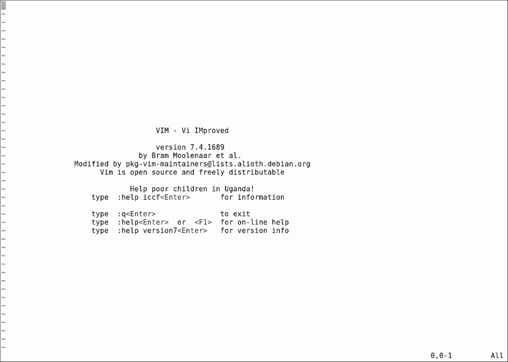
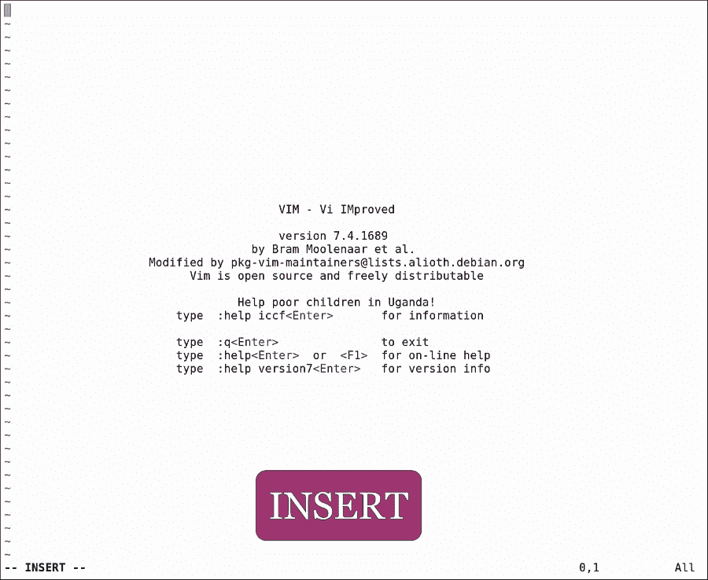
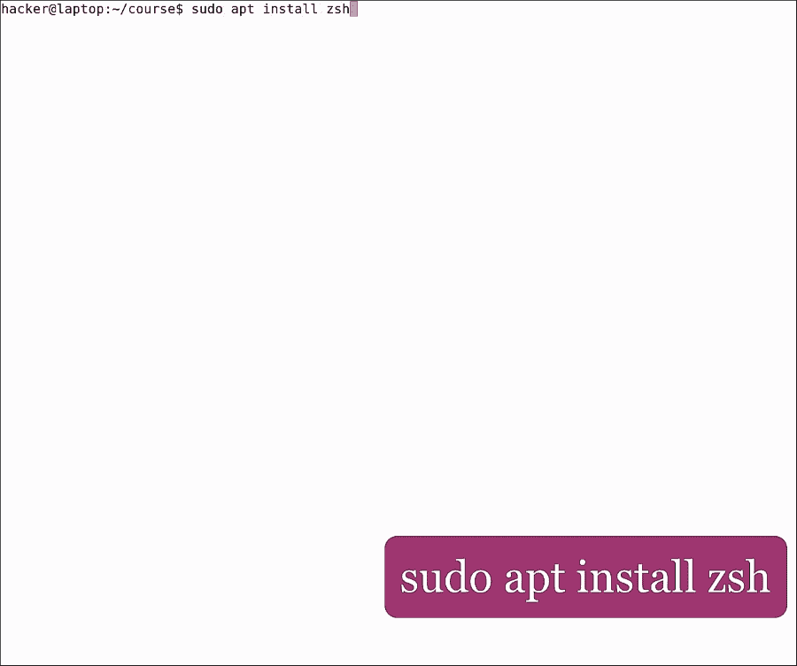
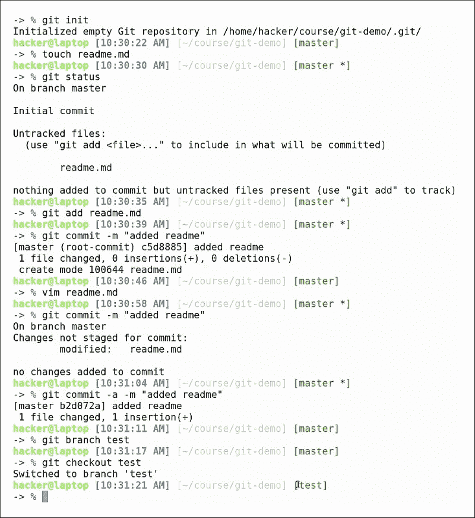
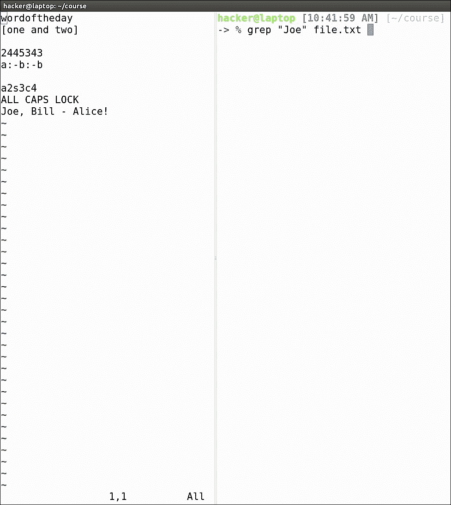
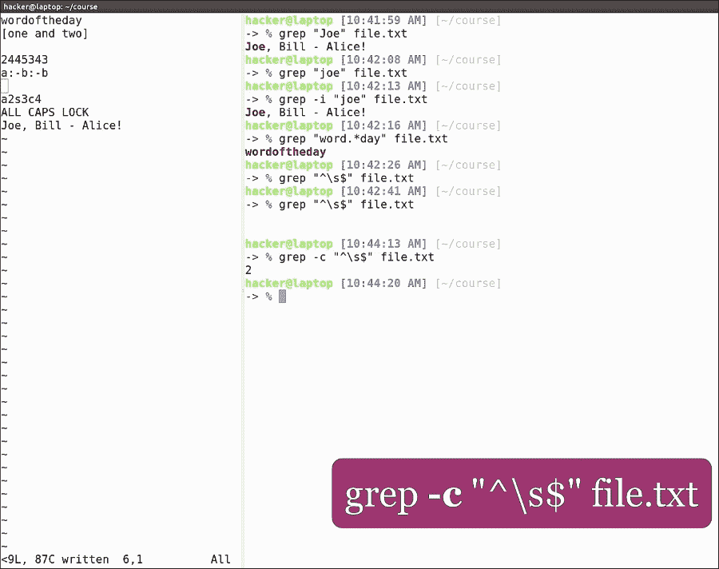
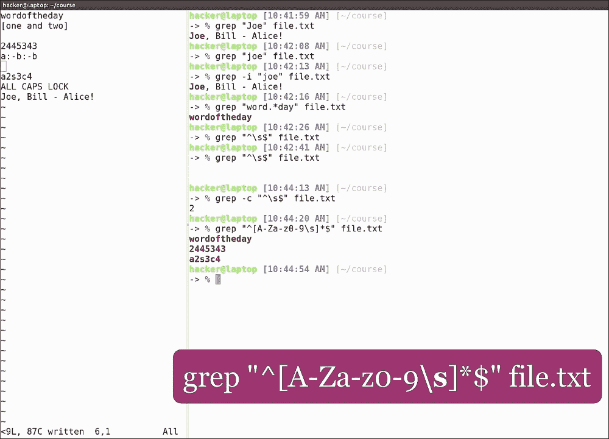
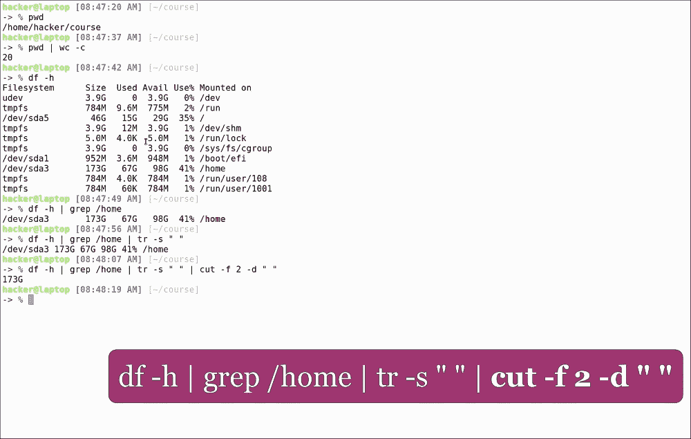
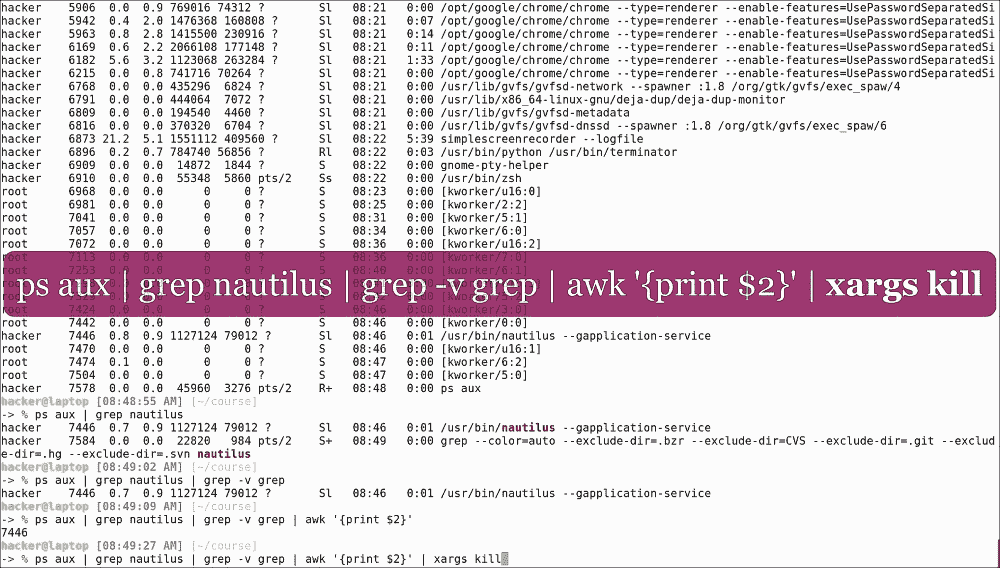
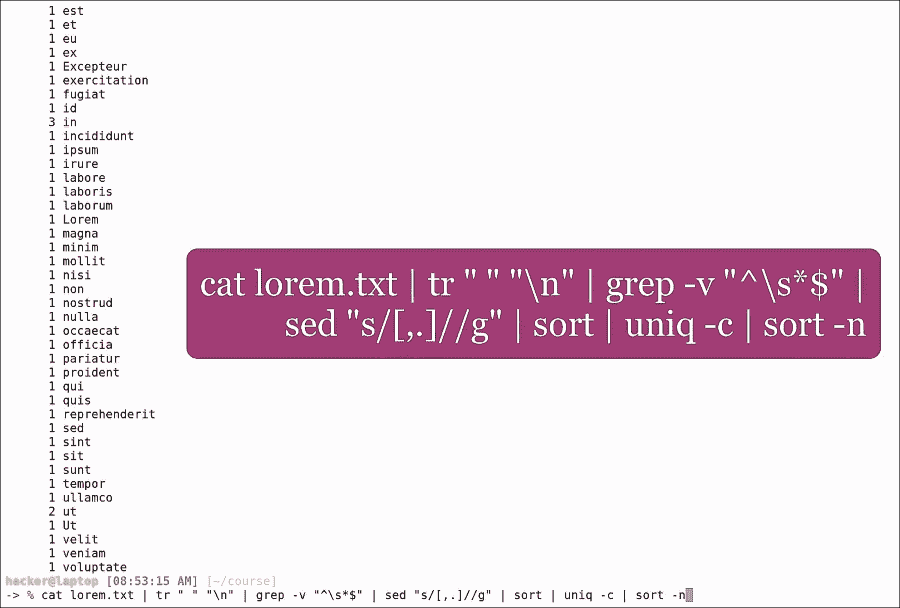

# 二、高效 Shell——重塑你的工作方式

在本章中，我们将从 Vim 的简短介绍开始，并查看最基本的命令来帮助您开始基本的 CRUD(创建、读取、更新、删除)操作。然后，我们将把 shell 解释器升级到 zsh，并通过令人敬畏的`oh-my-zsh`框架赋予它超能力。我们将研究一些基本的正则表达式，例如使用 grep 搜索一些文本。然后，我们将释放 Unix 管道的力量，并使用子 Shell 运行嵌入式命令。本章的后半部分将通过展示一些更高级的 shell 脚本技术来帮助我们理解如何提高工作效率并自动化我们的许多日常工作。

在本章中，我们将介绍以下内容:

*   与 Vim 合作
*   使用`oh-my-zsh`框架管理 zsh
*   使用管道和子 Shell 编写和运行超级强大的单行命令
*   探索 shell 脚本库

我们将专注于编辑文件。为此，我们需要选择一个文件编辑器。有很多选择，但考虑到编辑文件的最快方法当然是不离开终端。我们推荐 Vim。Vim 是一个很棒的编辑！它有很多配置选项，有一个巨大的社区，产生了很多插件和美丽的主题。它还具有先进的文本编辑功能，这使得它超可配置和超快。

所以，让我们继续。打开终结器，键入`sudo apt install vim`安装 Vim:


Vim 以其奇异的键盘控制而闻名，很多人因此而避免使用 Vim。但是一旦你掌握了基本知识，它就非常容易使用。

让我们不争论地开始`vim`:



这是默认屏幕；你可以在第二行看到版本。

*   To start editing text, press the *Insert* key; this will take us to the insert mode, where we can start typing. We can see we are in the insert mode at the bottom of the screen:

    

*   再次按下*插入*键，进入替换模式并覆盖文本。
*   按下 *Esc* 键退出插入或更换。
*   键入 *yy* 复制一行。
*   键入 *p* 粘贴线条。
*   键入 *dd* 以切断线路。
*   Type *:w* to save any changes. Optionally, specify a filename:

    

*   要在编辑文本中保存文件，请键入`vim.txt`
*   键入`:q`退出 Vim

让我们再次打开文件，做一个小小的更改:

*   `:wq`:同时写入和退出
*   `:q!`:不保存退出

现在您已经熟悉了这些命令，我们可以直接从命令行进行基本的文件编辑。这是任何人在使用 Vim 时需要知道的最起码的知识，我们将在接下来的章节中使用这些知识。

我们还将有一整节关于 Vim 的内容，我们将在今天最酷的终端编辑器中详细介绍如何提高效率！

# 哦，我的天，你的终端从来没有感觉这么好！

Bash 可能是最常用的 Shell。它有很多特性和强大的脚本功能，但是在用户交互方面，`zsh`更好。它的大部分力量来自令人敬畏的框架`oh-my-zsh`。在本节中，我们将安装`zsh`。

让我们从`oh-my-zsh`框架开始，我们将了解一些基本配置选项:

*   Open the terminator and type `sudo apt install zsh` to install `zsh`, as shown in the following image:

    

安装完成后，转到此链接，[https://github.com/robbyrussell/oh-my-zsh](https://github.com/robbyrussell/oh-my-zsh,)，按照说明安装`oh-my-zsh`框架。安装过程是用`curl`或`wget`的一行命令。让我们逐一使用这两个命令来安装它:

**通过卷曲:**

```sh
sh -c "$(curl -fsSL https://raw.githubusercontent.com/robbyrussell/oh-my-zsh/master/tools/install.sh)"

```

**通过 wget:**

```sh
sh -c "$(wget https://raw.githubusercontent.com/robbyrussell/oh-my-zsh/master/tools/install.sh -O -)"

```

你会看到命令给出了一个错误，说`git`没有安装，所以我们也需要安装。以下命令行用于安装 git:

```sh
sudo apt install git

```


注意在 Ubuntu 中安装软件是多么容易。这也是生产力的一大助推器；我们可能需要的每一个通用软件包都已经预先打包在远程软件仓库中，只需要一个命令就可以将新软件添加到我们的计算机中。

现在我们已经安装了`git`，让我们再次运行命令。我们可以看到，这一次它成功地发挥了作用，并为我们带来了新的 Shell。`Oh-my-zsh`也将默认 Shell 改为`zsh`。

安装后，首先要做的是去选择一个主题。要查看所有可用的主题，请运行以下命令:

```sh
ls ~/.oh-my-zsh/themes

```


### 注

你也可以去`git`回购看看主题，连同他们的截图。我们将使用 *candy* 主题，因为它在提示中有很多有用的信息: *username* 、 *hostname* 、 *time* 、*文件夹*和 *git* 分支/ *git* 状态。

时间可能非常有用，例如，如果您想知道一个命令执行了多长时间，并且没有使用 *time* 实用程序来测量命令的总运行时间。然后，你可以查看提示，看看命令开始的时间和知道命令完成的提示，这样你就可以计算出总时间了。

要更改主题，`open ~/.zshrc`并修改`ZSH_THEME`变量。保存文件并打开一个新的终端窗口。让我们初始化一个空的`git`目录，这样我们就可以看到提示的样子。你可以看到我们在主分支:


让我们创建一个文件，比如`readme.md`。提示中的`*`显示目录不干净。我们可以用`git status`命令来验证这一点:


你可以看到它是如何被验证的。我们清理完目录后，`*`就没了。如果我们改变分支，提示显示我们在新的分支上。

让我们快速创建一个演示。在您的终端上运行以下命令:

```sh
git branch test
git checkout test
```



现在，您可以在提示中看到分支名称，还有一些其他很酷的功能，您可能想探索一下:

*   **Command completion**: Start typing, for example, ip, and press *Tab*. We can see all the commands that start with IP and we can hit *Tab* again to start navigating through the different options. You can use the arrow keys to navigate and hit *Enter* for the desired command:

    

*   **Params completion**: For example type `ls -` and press *Tab*, and we can see here all the options and a short description for each. Press *Tab* again to start navigating through them and *Enter* to select.

    

*   **历史导航**:点击向上箭头键搜索历史，按光标前写的字符串过滤。例如，如果我键入`vim`并按下向上箭头键，我可以看到历史中所有用 Vim 打开的文件。
*   **历史搜索**:按 *Ctrl* + *R* 开始打字，再次按 *Ctrl* + *R* 搜索历史中的同一次发生。例如 *~* ， *Ctrl* + *R* 查看字符串中有 *~* 的所有命令。
*   **导航**:这里按 *Ctrl* +左右箭头跳一个字， *Ctrl* + *W* 删除一个字，或者 *Ctrl* + *U* 删除整行。
*   **cd 补全不区分大小写**:比如`cd doc`会扩展成`cd Documents`。
*   **光盘目录完成**:如果你很懒，想在一个路径中只指定几个关键字母，我们也可以这样做。比如`cd /us/sh/zs` + *Tab* 会展开成`cd /usr/share/zsh`。
*   **击杀完成:**只需输入`kill`*Tab*即可看到`pids`击杀列表。从那里你可以选择杀死哪个进程。
*   **chown completion** :键入`chown`并点击标签查看要更改所有者的用户列表。这同样适用于团体。
*   **参数扩展**:键入`ls *`，点击*选项卡*。您会看到`*`扩展到当前目录中的所有文件和文件夹。对于子集，键入`ls Do*`并按下*选项卡*。它只会扩展到文档和下载。
*   **Adds lots of aliases:** Just type alias to see a full list. Some very useful ones are:

    ```sh
    .. - go up one folder
    … - go up two folders
    - - cd o the last directory
    ll - ls with -lh
    ```

    

要查看快捷方式列表，运行`bindkey`命令。终端是你会花很多时间的地方之一，所以掌握我们的 Shell 并尽可能高效地使用它真的很重要。知道好的捷径，查看相关的浓缩信息，比如我们的提示，可以让我们的工作轻松很多。

# 基本正则表达式

*你有问题想用正则表达式解决？现在你有两个问题！*这只是网络上众多正则表达式段子之一。

在本节中，您将学习正则表达式是如何工作的，因为我们将在接下来的章节中使用它们。我们已经为我们的游乐场准备了一个文件，如果你想自己尝试 grep 命令，你可以从 GitHub 存储库中获取它。

让我们从打开文本文件开始，这样我们就可以看到它的内容，然后分割屏幕，这样我们就可以并排看到文件和命令。

首先，最简单，也可能是最常见的正则表达式是找到一个单词。

为此，我们将使用`grep "joe" file.txt`命令:



`joe`是我们正在搜索的字符串，`file.txt`是我们执行搜索的文件。您可以看到 grep 打印了包含我们的字符串的行，并且该单词用另一种颜色突出显示。这将只匹配单词的确切大小写(因此，如果我们使用小写`j`，这个正则表达式将不再工作)。要进行不区分大小写的搜索，`grep`有一个`-i`选项。这意味着 grep 将打印包含我们单词的行，即使单词在不同的情况下，如 JoE、JOE、joE 等等:

```sh
grep -i "joe" file.txt
```


如果我们不知道我们的字符串中到底有哪些字符，我们可以使用`.*`来匹配任意数量的字符。例如，要找到以“单词”开头、以“天”结尾的句子，我们可以使用`grep "word.*day" file.txt`命令:

*   `.` -匹配任何字符
*   `*` -多次匹配前一个字符

在这里，您可以看到它与文件中的第一行匹配。

一个非常常见的场景是在文件中查找空行。为此，我们使用`grep "^\s$" file.txt`命令:

*   其中`\s`:这代表空间，
*   `^`:是为了台词的开头。
*   `$`:是为了它的结局。

我们有两条没有空格的空行。如果我们在行之间添加一个空格，它将匹配包含一个空格的行。这些被称为**锚**。

`grep`可以做一个整齐的小把戏来数火柴的数量。为此，我们使用`-c`参数:



要查找所有只有字母和空格的行，请使用:

*   `grep`
*   `""`:开放报价
*   `^$`:从头到尾
*   `[]*`:匹配这些字符任意多次
*   `A-Za-z`:任意大小写字母

如果我们运行命令到这里，我们只得到第一行。如果我们加上:

*   - 0-9 我们匹配另外两行的任何数字，
*   如果我们添加任何空格，我们也会匹配空行和所有大写的行
*   如果我们在这里运行命令，我们只得到输出的第一行，其余的不显示
*   然后，如果我们添加 0-9，我们匹配任何数字(因此前两行匹配)
*   And if we add \s we match any type of space (so the empty lines are matched as well)

    ```sh
    grep "^[A-Za-z0-9\s]*$" file.txt

    ```

    

有时我们需要搜索字符串中没有的东西:

```sh
grep "^[^0-9]*$" file.txt

```

该命令将查找所有不只有数字字符的行。`[^]`表示匹配所有不在里面的字符，在我们的例子中，任何非数字。

方括号是我们正则表达式中的标记。如果我们想在搜索字符串中使用它们，我们必须逃离它们。因此，为了找到方括号中包含内容的行，请执行以下操作:

```sh
grep "\[.*\]" file.txt

```

这适用于方括号中包含字符的任何行。要查找具有这些字符`!`的所有行，请键入以下内容:

```sh
grep "\!" file.txt

```

现在让我们来看一个基本的`sed,`让我们找到`Joe`字并用`All`字替换:

```sh
sed "s/Joe/All/g" file.txt

```


这将用字符串`All`替换字符串`Joe`的每次出现。在接下来的章节中，我们将深入探讨这一点。

正则表达式，比如 Vim，是很多人害怕的东西之一，因为一开始学起来似乎很复杂。尽管正则表达式看起来很神秘，但一旦掌握了它，它就成了方便的伙伴:它们并不局限于我们的 shell，因为在大多数编程语言、数据库、编辑器以及包括搜索字符串在内的任何其他地方，语法都非常相似。在接下来的章节中，我们将更详细地讨论正则表达式。

# 水管和地下管道——你的贝壳是盐和胡椒

在本节中，我们将探讨如何使用 shell 提高您的工作效率。Linux 命令行很棒，因为它有我们可以使用的各种工具。更伟大的是，我们可以将这些工具链接在一起，形成更强大的工具，让我们更有效率。我们将不进入基本的 shell 命令；取而代之的是，我们将会看到一些可以让我们的生活变得更轻松的酷管道和地下组合。

让我们从一个基本管道开始；在本例中，我们使用以下命令计算当前路径的长度:

```sh
pwd | wc -c

```


`pwd,`你可能知道，代表`print working directory`。`|`是管道符号，它的作用是将左边命令的输出发送到右边命令。在我们的例子中，`pwd`正在将其输出发送到`wc -c`，后者计算字符数。管道最酷的一点是，你可以创建任意数量管道的链。

让我们看另一个例子，我们将看到如何找到驱动器上的已用空间:

```sh
df -h | grep /home | tr -s " " | cut -f 2 -d " "

```



*   `"df -h"`:以人类可读的格式显示磁盘使用情况
*   `"| grep /home"`:这里只显示主目录
*   `'| tr -s " "'`:这将多个空格替换为一个空格
*   `'| cut -f 2 -d " "'`:这将使用空格作为分隔符来选择第二列

可以看到，这个命令打印出了`173G`，这个`/home`分区的大小。这是一个常见的用例当链接多个命令时，每个命令都会减少输出，直到我们得到想要的信息，其他什么都没有。在我们的例子中，这是已用的磁盘空间。

要计算文件夹中所有目录的数量，请使用以下命令:

```sh
ls -p | grep / | wc -l

```


基本思路是统计所有以`/`结尾的行。这里我们可以看到我们只有一个目录。

管道是发现和终止流程的一个很好的选择。假设我们要找到`nautilus`的进程 ID，以及`kill all`的运行实例。为此，我们使用:

```sh
ps aux | grep nautilus | grep -v grep | awk '{print $2}' | xargs kill

```



*   `ps aux`:这会打印所有带 PID 的进程
*   `| grep nautilus`:找到匹配鹦鹉螺的
*   `| grep -v grep`:反转`grep`排除`grep`进程
*   `| awk '{print $2}'`:选择行中的第二个字，即 PID
*   `| xargs kill`:这里`xargs`用于将每个 PID 分配给一个杀死命令。它特别用于不从标准输入中读取参数的命令。

现在我们已经杀死了`nautilus`。这纯粹是一个说明性的例子。还有其他方法可以做到这一点。

让我们再次打开`nautilus`并通过点击 *Ctrl* + *Z* 然后点击`bg`命令将其发送到后台。

现在让我们运行以下命令:

```sh
pgrep nautilus

```

要查看`nautilus`的所有`pids`并向所有这些进程发送终止信号，请使用以下命令行:

```sh
pkill nautilus

```

现在是时候建立一些关系网了！您可能知道`ifconfig`命令，该命令用于打印关于网络接口的信息。要获取特定接口(在我们的例子中是无线接口`wlp3s0`)的 IP 地址，请运行以下命令:

```sh
ifconfig wlp3s0 | grep "inet addr:" | awk '{print $2}' | cut -f 2 -d ":"

```


*   `ifconfig wlp3s0`:打印`wlp3s0`界面的联网信息
*   `| grep "inet addr:"`:获取带有 IP 地址的线路
*   `| awk '{print $2}'`:选择行中的第二个单词(我们也可以使用 cut)
*   `| cut -f 2 -d ":"`:被`":"`拆分，只打印第二个字

现在，我们在屏幕上看到你的`private ip`地址。

一个可能出现的常见用例是计算文件中的词频。

这里我们有一个包含在`lorem.txt`中的标准知识文本。为了获得词频，请使用以下内容:

```sh
cat lorem.txt | tr " " "\n" | grep -v "^\s*$" | sed "s/[,.]//g" | sort | uniq -c | sort -n

```



*   `cat lorem.txt`
*   `| tr " " "\n"`:将每个空格转换成一个新的行字符
*   `| grep -v "^\s*$"`:消除空行
*   `| sed "s/[,.]//g"`:删除逗号(，)和句号(。)只选择单词
*   `| sort`:按字母顺序排列结果
*   `| uniq -c`:只显示唯一的线条
*   `| sort -n`:按数值排序

追加`grep -w id`查找单词 ID 的出现频率，或者`grep -w 4`查看所有出现四次的单词。

现在让我们继续我们的第一个子壳例子。子 Shell 可以通过将它们包含在`$()`中，或者使用倒勾( *`* )来编写。背景音通常出现在键盘上的 *Esc* 键下。在我们所有的例子中，我们将使用第一种形式，因为它更容易阅读。

我们的第一个示例是列出当前文件夹中的所有文件夹:

```sh
ls $(ls)

```

`ls`子 Shell 返回当前目录中的文件和文件夹，子 Shell 外部的`ls`将分别列出这些文件和文件夹，显示更多详细信息:

*   计算当前目录中的所有文件和目录
*   给定事实，逗号(，)和句点(。)是标记当前目录和父目录的硬链接，我们需要计算所有条目减去这两个
*   This can be done using the `expr $(ls -a | wc -l ) - 2` command:

    

在这里，子 shell 将返回条目的数量(在本例中是五个)。我们要找的数字是条目数减去特殊文件夹(“`.`”和“`..`”)。为了进行算术运算，我们使用`expr`命令，如我们的例子所示。

请注意，子壳包含一个管道。好的方面是，我们可以以任何方式组合管道和子 Shell，以获得期望的结果。

想象一下，管道和子 Shell 就像你的壳的乐高零件。它们远远超出了它的能力，让你接触到无限组合的新可能性。最终，这完全取决于你的想象力和你如何学会运用它们。

# 为了乐趣和利润而编写 Shell 脚本

管道和子 Shell 是扩展我们 Shell 能力的一种方式。最终的方法是通过编写 shell 脚本。在处理无法用一行命令自动完成的复杂任务时，必须考虑这些场景。

好消息是，几乎所有的任务都可以通过使用 shell 脚本来实现自动化。我们将不讨论 Shell 脚本的介绍。相反，我们将考虑一些更高级的用例来编写它们。

让我们开始进入 shell 脚本的旅程吧！首先，让我们打开一个名为`script.sh`的文件，分割屏幕，这样我们就可以边写边测试了。每个 shell 都应该以`#!`开头，后面跟着它使用的解释器。这一行叫做**舍邦**。我们将使用 bash 作为我们的默认解释器。

使用 bash 是个好主意，因为它是大多数 Linux 发行版和 OS X 都有的通用解释器:

```sh
#!/bin/bash

```

让我们从一个简单的用例开始:读取传递到命令行的参数。我们将第一个命令行参数`$1`的值赋给一个名为 ARG 的变量，然后将其打印回屏幕:

```sh
ARG=${1}
echo ${ARG}
```

让我们保存我们的脚本，为它分配执行权限，然后用一个参数运行它:

```sh
./script.sh test

```


如您所见，价值测试被打印回屏幕。在某些情况下，我们希望为变量分配默认的值。为此，在变量赋值中添加":-"，后跟默认值:

```sh
ARG=${1:-"default value"}

```

现在如果我们重新运行脚本，我们可以看到不传递参数将会`echo default value`。就像管道一样，我们可以将多个默认值分配链接在一起。我们可以定义另一个变量`AUX`，给它赋值`123`，在使用`"default value"`脚本之前，使用相同的语法给 ARG 变量赋值，如下所示:

```sh
AUX="123"
ARG=${1:-${AUX:-"default value"}}

```


在这种情况下，ARG 将始终接收 123 作为其默认值。

现在让我们看看字符串选择器。要选择子字符串，请使用“:”，加上起始位置加“:”，加上字符数:

```sh
LINE="some long line of text"echo "${LINE:5:4}" 

```


在我们的例子中，我们将选择四个字符，从第五个字符开始。运行脚本后，我们可以看到屏幕上打印的数值`long`。

大多数 shell 脚本设计为从命令行运行，并接收可变数量的参数。为了在不知道参数总数的情况下读取命令行参数，我们将使用`while`语句，该语句使用-z(或不等于 0)条件表达式检查第一个参数是否不为空。在 while 循环中，让我们回显变量的值并运行 shift，它将命令行参数向左移动一个位置:

```sh
while [[ ! -z ${1} ]]; do
echo ${1}
shift  # shift cli arguments
done

```


如果我们用参数 *a* *b* *c* 运行我们的脚本，我们可以看到我们的 while 遍历参数，并在单独的一行上打印每个参数。现在让我们扩展命令行界面参数解析器，并添加一个 *case* 语句来解释参数。

让我们假设我们的脚本将有一个帮助选项。Posix 标准建议用`--`做一个长参数版本，只用一个`-`做一个短版本。所以`-h`和`--help`都会打印帮助信息。此外，当用户发送无效选项，然后以非零退出值退出时，建议始终使用默认案例并打印消息:

```sh
while [[ ! -z ${1} ]]; do
    case "$1" in
        --help|-h)
            echo "This is a help message"
            shift
            ;;
        *)
            echo "invalid option"
            exit 1
            ;;
    esac
done
```


如果我们用-h 运行我们的脚本，我们可以看到帮助消息被打印出来，就像我们使用了`--help`一样。如果我们使用任何其他选项运行脚本，将打印无效的选项文本，并且脚本以退出代码 1 退出。要获取最后一个命令的退出代码，请使用`"$?"`。

现在让我们看看 shell 中的基本函数。语法与其他编程语言非常相似。让我们编写一个名为`print_ip`的函数，该函数将打印指定为的接口的 IP 作为第一个参数。我们将使用一个子 Shell，并将值赋给一个名为 IP 的变量。我们的剪贴板中已经有了完整的命令；这和我们在管道课上看到的一样:

```sh
function print_ip() {
    IP=$(
        ifconfig ${1} | \
        grep "inet addr:" | \
        awk '{print $2}' | \
        cut -f 2 -d ":"
    )   
    echo ${IP}
}
```


现在，让我们在 switch 语句中添加另一种情况，用于`-i`或`--ip`选项。该选项后面将跟随接口的名称，然后我们将该名称传递给`print_ip`功能。一个选项有两个参数意味着我们需要调用 shift 命令两次:

```sh
--ip|-i)
    print_ip ${2}
    shift
    shift
    ;;
```

让我们做一个`ifconfig`来获得我们的无线接口的名称。我们可以看到它是`wlp3s0`。

现在让我们运行:

```sh
./script.sh --ip wlp3s0
```

我们可以看到 IP 地址。这是一个非常基本的用例，在这里我们可以看到命令行参数是如何传递的。我们可以在 case 语句中添加无限的选项，定义处理参数的函数，甚至可以将多个选项链接在一起，形成复杂的脚本，接收结构良好的信息作为命令行参数。

高效意味着更快地完成任务——真的很快！而且说到速度，bash 在脚本解释器方面也不是首选。幸运的是，我们还有一些锦囊妙计！如果一个 shell 脚本需要运行多个独立的任务，我们可以使用 *&* 符号将进程发送到后台并前进到下一个命令。

让我们创建两个函数`long_running_task 1`和`2`，并在里面添加一个`sleep`命令，来模拟一个`long_running`任务:

```sh
function long_running_task_1() {
    sleep 1
}

function long_running_task_2() {
    sleep 2
}
```

第一个长时间运行的任务功能会休眠一秒钟，下一个会休眠两秒钟。

然后，出于测试目的，让我们在 switch 语句中添加另一个案例，称为`-p / --`并行，并运行两个长时间运行的任务:

```sh
--parallel|-p)
    long_running_task_1 
    long_running_task_2
```

现在，如果我们运行这个:

```sh
./script.sh -p
```

脚本总共需要三秒钟才能完成。我们可以用*时间*工具来测量:


如果我们在后台运行这两个函数，我们可以将运行时间减少到这两个函数的最长运行时间(因为等待)。当运行长时间运行的任务时，我们可能希望脚本等待运行时间最长的任务完成，在我们的例子中是任务 2。我们可以通过抓取第二个任务的`pid`来实现。这里`$!`用来抓取最后一个运行命令的`pid`。然后，我们使用内置的等待 shell 来等待执行完成:

```sh
--parallel|-p)
    long_running_task_1 &
    long_running_task_2 &
    PID=$!
    wait ${PID}
```

使用 time 实用程序再次运行脚本后，我们可以看到我们总共需要两秒钟来完成任务。

谁能想到我们可以在一个 Shell 中进行并行处理？

如果执行时间较长，我们可以在脚本完成时添加通知:

```sh
notify-send script.sh "execution finished"
```


这样，我们可以启动脚本，处理一些其他任务，并在脚本完成时收到通知。你可以让你的想象力在平行的处理和通知中尽情发挥。

在本章中，我们已经看到了一些常见的预定义 Shell 变量。他们是:

*   `$1`:第一个参数
*   `$?`:最后一个命令的返回代码
*   `$!`:最后一次命令运行的`pid`

其他常用的预定义 Shell 变量包括:

*   `$#`:参数数量
*   `$*`:参数列表
*   `$@`:所有参数
*   `$0`:Shell/脚本的名称
*   `$$`:当前运行 Shell 的 PID

Bash 有很多特性，我们建议通过它的手册页来获得更多关于它们的信息。

如果用对了方法，Shell 脚本是很神奇的。他们可以微调系统命令，就像我们在例子中看到的那样，我们只获得了 IP 地址，而没有整个`ifconfig`输出等等。作为一个务实的终端用户，您应该确定在命令行中最常执行的任务，以及使用 shell 脚本可以自动执行的任务。您应该创建自己的 shell 脚本集合，并将它们添加到您的路径中，以便可以从任何目录中轻松访问它们。

# Shell 脚本库

要真正利用 shell 脚本实现任务自动化，重要的是将所有常见任务组织到可重用命令中，并让它们在路径中可用。为此，最好在主目录中为脚本创建一个`bin`文件夹，并在`bin/lib`目录中存储常用代码。当使用大量 shell 脚本时，重用大部分功能是很重要的。这可以通过为 shell 脚本编写库函数来实现，这些函数可以从多个地方调用。

这里我们将创建一个名为`util.sh`的库脚本，它将来源于其他脚本。通过获取脚本，我们可以从库脚本中访问函数和变量。

我们将从添加上一个脚本中的`print_ip`函数开始。

现在我们将添加另一个名为`getarg`的函数，它将被其他脚本用于读取命令行参数和值。我们将简单地从剪贴板历史中粘贴它，使用剪贴板选择它。

您可以通过查看我们的剪辑部分了解更多关于剪辑的信息！

```sh
Function to read cli argument:
function getarg() {
    NAME=${1}
    while [[ ! -z ${2} ]]; do
        if [[ "--${NAME}" == "${2}" ]]; then
            echo "${3}"
            break
        fi
        shift
    done
}   
```


这只是一个简单的函数，它将接收一个参数名称作为第一个参数，命令行界面参数列表作为第二个参数，它将在命令行界面参数列表中搜索以找到参数名称。我们将在稍后看到它的实施。

我们要创建的最后一个函数叫做`get_public_ip`。它在功能上类似于`print_ip`功能，只是它将用于打印计算机的公共 IP。这意味着，如果您连接到无线路由器并访问互联网，您将获得路由器的 IP，这是其他站点看到的 IP。`print_ip`功能只是显示私有子网的 IP 地址。

该命令已经复制到剪贴板中。它叫做**挖**我们用它来访问[https://www.opendns.com/](https://www.opendns.com/)以便阅读公众`ip`。你可以在它的手册页或者谷歌上找到更多关于的信息:

```sh
function get_public_ip() {
    dig +short myip.opendns.com @resolver1.opendns.com
}
```

现在我们已经有了我们的库函数，让我们去创建我们的生产力增强脚本。让我们创建一个名为“T2”的脚本，我们将在其中添加一些读取 IP 地址的常见任务。

我们将从添加 shebang 开始，接下来是一个整洁的小技巧，以确保我们总是与执行的脚本在同一个文件夹中。我们将使用`BASH_SOURCE`变量来确定**当前工作目录**(或 **CWD** )变量的值。您可以在这里看到，我们使用嵌套子 Shell 来实现这一点:

```sh
CWD=$( cd "$(dirname "${BASH_SOURCE[0]}" )/" && pwd )
cd ${CWD}

```

接下来我们将源码`util`脚本，这样库函数就导出到内存中了。然后，我们可以从当前脚本中访问它们:

```sh
source ${CWD}/lib/util.sh

```

让我们使用一个子 Shell 对我们的`getarg`函数添加一个简单的调用，并搜索`cmd`参数。此外，让我们重复我们的发现，以便我们可以测试我们的脚本:

```sh
CMD=$(getarg cmd $@)
echo ${CMD}

```

接下来我们需要做的是使用`chmod`命令赋予脚本执行权限。此外，为了从任何地方运行脚本，`bin`文件夹必须在 PATH 变量中。回显该变量并检查 bin 文件夹是否存在，如果不存在，则更新`~/.zshrc`中的变量。

让我们通过读取带有`getarg`函数的命令行参数并回显来测试脚本。

如果您使用 tab 键在终端中搜索`iputils`命令进行自动完成，而该命令似乎不存在，这可能是因为您需要告诉`zsh`重新加载其路径命令。为此，请发出“rehash”命令。

现在运行:

```sh
iputil --cmd ip

```

这应该在任何文件夹内工作，并且应该在屏幕上打印`ip`。

现在我们已经验证了一切正常，让我们为命令行参数编写一些代码。如果我们运行带有`--cmd ip`标志的脚本，脚本应该在屏幕上打印出来。这可以通过已经熟悉的`case`语句来实现。在这里，我们还想传递另一个参数，`--iface,`来获得打印 IP 所需的接口。添加一个默认案例并回显一条消息表示`invalid`参数也是一个很好的做法:

```sh
case ${CMD} in
    ip)
        IFACE=$(getarg iface $@)
        print_ip ${IFACE}
        ;;
    publicip)
        get_public_ip
        ;;
    *)
        echo "Invalid argument"
esac
```

保存脚本，让我们测试它。

首先让我们从`ifconfig`命令中获取接口名称，然后让我们通过运行这个命令来测试脚本:

```sh
iputil --cmd ip --iface wlp3s0

```


我们可以看到它正在屏幕上打印我们的私人`ip`。

现在让我们将最后一个`cmd`添加到脚本中:`publicip`。

为此，我们只需从我们的`lib`实用程序中调用`get_public_ip`函数。保存并运行以下内容:

```sh
iputil --cmd publicip

```

我们看到命令起作用了；我们的公众`ip`就印在屏幕上。以下是完整的脚本:

```sh
#!/bin/bash 

CWD=$( cd "$( dirname "${BASH_SOURCE[0]}" )/" && pwd )
cd ${CWD}

source ${CWD}/lib.sh

CMD=$(getarg cmd $@)

case ${CMD} in
    publicip)
        print_public_ip
        ;;
    ip)
        IFACE=$(getarg iface $@)
        print_ip $IFACE
        ;;
    *)
        echo "invalid command"
esac
```

举个例子，前阵子网上有一大堆文章，讲的是一个人，他曾经把所有需要 90 多秒才能完成的事情自动化。他写的脚本包括指示咖啡机开始制作拿铁，这样当他到达机器时，拿铁已经完成，他不需要等待。他还写了一个脚本，向妻子发送了一条“上班迟到”的短信，并在晚上 9 点后，每当他登录公司服务器有活动时，自动从预设列表中选择一个原因。

当然，这个例子有点复杂，但最终都是关于你的想象。写得好的自动化脚本可以处理你的日常工作，让你去发掘你的创造潜力。