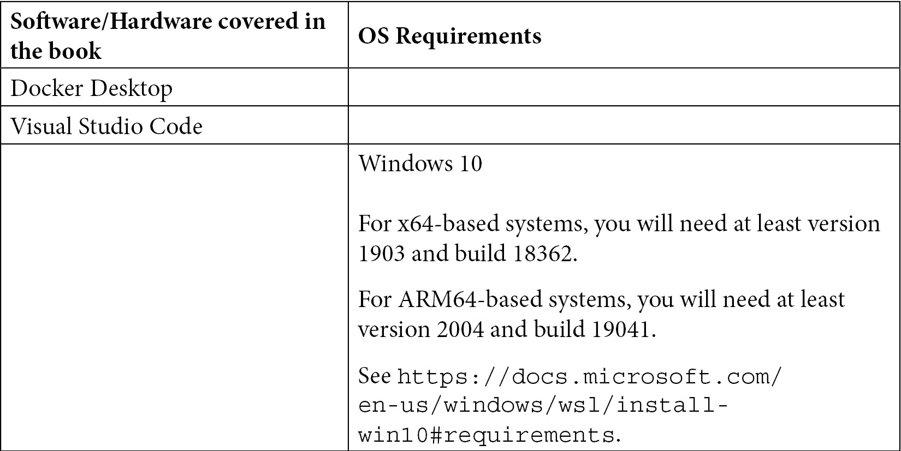

# 零、前言

面向 Linux 的 Windows 子系统(WSL)是来自微软的一项令人兴奋的技术，它将 Linux 与 Windows 结合在一起，并允许您在 Windows 上运行未修改的 Linux 二进制文件。 与在隔离的虚拟机中运行 Linux 的体验不同，WSL 提供了丰富的互操作性功能，允许您将来自每个操作系统的工具结合在一起，允许您使用最佳的工具来完成工作。

通过使用 WSL 2，微软通过改进性能和提供完整的系统调用兼容性来提高 WSL，从而在利用该特性时提供更多的功能。 此外，其他技术，如 Docker Desktop 和 Visual Studio Code，已经添加了对 WSL 的支持，并添加了更多利用它的方法。

通过 Docker Desktop 的 WSL 集成，您可以在 WSL 中运行 Docker 守护进程，提供了一系列好处，包括从 WSL 装载卷时的性能提高。

Visual Studio Code 中的 WSL 集成使您能够在 WSL 中安装项目工具和依赖项以及源代码，并让 Windows 用户界面连接到 WSL 以加载代码，并在 WSL 中运行和调试应用。

总而言之，WSL 是一项令人兴奋的技术，它对我的日常工作流程做出了巨大的改进，我希望在您阅读这本书的时候与您分享这种兴奋!

# 这本书是给谁的?

本书面向那些想在 Windows 上使用 Linux 工具的开发人员，包括那些希望根据项目需求轻松进入 Linux 环境的 Windows 本地程序员，或者最近转向 Windows 的 Linux 开发人员。 这本书也适合那些使用 linux 优先工具(如 Ruby 或 Python)从事开源项目的 web 开发人员，或者那些希望在容器和开发机器之间切换以测试应用的开发人员。

# 这本书的内容是什么?

[*第一章*](01.html#_idTextAnchor017)，*Windows 子系统简介*，概述了 WSL 是什么，并探讨了 WSL 1 和 WSL 2 之间的区别。

第二章[](02.html#_idTextAnchor023)*,*安装和配置 Windows 子系统为 Linux*,带你通过安装 WSL 2 的过程中,与 WSL 如何安装的 Linux 发行版,如何控制和配置 WSL。*

 *[*第三章*](03.html#_idTextAnchor037)，*Windows 终端入门*，介绍了新的 Windows 终端。 这个来自微软的新的开源终端正在迅速发展，它为使用 WSL 2 在 shell 中工作提供了很好的体验。 您将看到如何安装 Windows Terminal、使用它和自定义它的外观。

第四章[](04.html#_idTextAnchor047)*,*Windows, Linux 互操作性,开始深入 WSL 提供的互操作性的特点,通过观察如何访问文件和从 Windows 应用在您的 Linux 发行版。**

 **[*第五章*](05.html#_idTextAnchor054),*Linux, Windows 互操作性*,继续探索 WSL 互操作性特征通过展示如何从 Linux, Windows 文件和应用的访问和一些互操作性技巧和窍门。

[*第六章*](06.html#_idTextAnchor069)，*从 Windows 终端获取更多*，深入探讨了 Windows 终端的一些方面，如自定义标签标题和将标签拆分为多个窗格。 您将看到各种选项，包括如何从命令行控制 Windows Terminal(以及如何重用命令行选项以与正在运行的 Windows Terminal 一起工作)。 您还将看到如何添加自定义配置文件来增强您的日常工作流。

[*第七章*](07.html#_idTextAnchor082)，*在 WSL 中与容器一起工作*，介绍了在 WSL 2 中使用 Docker Desktop 来运行 Docker 守护进程。 您将看到如何为示例 web 应用构建和运行容器。 本章还展示了如何使用 Docker Desktop 中的 Kubernetes 集成来运行 WSL 中的 Kubernetes 示例 web 应用。

[*第八章*](08.html#_idTextAnchor098)，*使用 WSL 发行版*，将带领您完成导出和导入 WSL 发行版的过程。 此技术可用于将一个发行版复制到另一台计算机或在本地计算机上创建一个副本。 您还将看到如何使用容器映像快速创建新的 wsdl 发行版。

[*第 9 章*](09.html#_idTextAnchor111),*Visual Studio Code和 WSL*,快介绍 Visual Studio Code之前探索 Remote-WSL 扩展处理代码在你 WSL 从 Visual Studio Code发行版文件系统。 通过这种方法，您可以保留 Visual Studio Code 的丰富 GUI 体验，并使用所有在 WSL 中运行的代码文件、工具和应用。

[*第十章*](10.html#_idTextAnchor125),*Visual Studio Code和容器*,继续探索通过观察 Remote-Containers 扩展 Visual Studio Code,你可以包你所有项目依赖关系到一个容器中。 这种方法允许您隔离项目之间的依赖关系以避免冲突，并且还允许新团队成员快速开始工作。

[*第 11 章*](11.html#_idTextAnchor148)，*命令行工具的生产力技巧*，介绍了在命令行中使用 Git 的一些技巧，以及处理 JSON 数据的一些方法。 在此之后，本文探讨了 Azure 和 Kubernetes 命令行实用程序以及它们各自用于查询信息的方法，包括进一步探讨如何处理 JSON 数据。

# 为了最大限度地了解这本书

要跟上本书中的示例，您需要一个与 WSL 版本 2 兼容的 Windows 10 版本(见下表)。 你还需要 Docker Desktop 和 Visual Studio Code。

需要具备编程或开发经验，并对在 PowerShell、Bash 或 Windows 命令提示符中运行任务有基本的了解:



如果你正在使用这本书的数字版本，我们建议你自己输入代码或通过 GitHub 存储库访问代码(链接在下一节中)。 这样做将帮助您避免任何与复制和粘贴代码相关的潜在错误。

微软还宣布了 WSL 的一些附加特性(比如对 GPU 和 GUI 应用的支持)，但在撰写本文时，这些特性还不稳定，而且仅以早期预览形式提供。 本书选择将重点放在稳定的、已发布的 WSL 特性上，因此目前将重点放在当前以命令行为中心的 WSL 视图上。

# 下载示例代码文件

你可以从 GitHub 上的[https://github.com/PacktPublishing/Windows-Subsystem-for-Linux-2-WSL-2-Tips-Tricks-and-Techniques](https://github.com/PacktPublishing/Windows-Subsystem-for-Linux-2-WSL-2-Tips-Tricks-and-Techniques)下载这本书的示例代码文件。 如果代码有更新，它将在现有的 GitHub 存储库中更新。

我们还可以在[https://github.com/PacktPublishing/](https://github.com/PacktPublishing/)中找到丰富的图书和视频目录中的其他代码包。 检查出来!

# 下载彩色图片

我们还提供了一个 PDF 文件，其中包含了本书中使用的屏幕截图/图表的彩色图像。 你可以在这里下载:[https://static.packt-cdn.com/downloads/9781800562448_ColorImages.pdf](https://static.packt-cdn.com/downloads/9781800562448_ColorImages.pdf)。

# 使用的约定

本书中使用了许多文本约定。

`Code in text`:表示文本中的代码字、数据库表名、文件夹名、文件名、文件扩展名、路径名、虚拟 url、用户输入和 Twitter 句柄。 下面是一个例子:“为了改变 UI 中概要文件的顺序，我们可以改变`settings`文件中`profiles`下`list`条目的顺序。”

一段代码设置如下:

```sh
"profiles": {
    "defaults": {
        "fontFace": "Cascadia Mono PL"
    },
```

当我们希望提请您注意代码块的特定部分时，相关的行或项以粗体显示:

```sh
"profiles": {
    "defaults": {
        "fontFace": "Cascadia Mono PL"
    },
```

任何命令行输入或输出都写如下:

```sh
git clone https://github.com/magicmonty/bash-git-prompt.git ~/.bash-git-prompt --depth=1
```

**粗体**:表示新词条、重要词汇或在屏幕上看到的词汇。 例如，菜单或对话框中的单词会像这样出现在文本中。 下面是一个例子:“playground 在处理复杂查询时是一个很有帮助的环境，底部的**Command Line**部分甚至为您提供了可以复制并在脚本中使用的命令行。”

小贴士或重要提示

出现这样的。

# 联系

我们欢迎读者的反馈。

**一般反馈**:如果你对本书的任何方面有疑问，请在邮件主题中提及书名，并通过电子邮件发送至`customercare@packtpub.com`。

**Errata**:尽管我们已尽一切努力确保内容的准确性，但错误还是会发生。 如果您在这本书中发现了错误，请向我们报告，我们将不胜感激。 请访问[www.packtpub.com/support/errata](http://www.packtpub.com/support/errata)，选择您的图书，点击勘误表提交链接，并输入详细信息。

**盗版**:如果您在互联网上发现我们作品的任何形式的非法拷贝，请提供我们的位置地址或网址。 请通过`copyright@packt.com`与我们联系，并提供相关材料的链接。

**如果你有兴趣成为一名作家**:如果你有一个你擅长的话题，并且你有兴趣写作或写一本书，请访问[authors.packtpub.com](http://authors.packtpub.com)。

# 评论

请留下评论。 一旦你阅读和使用这本书，为什么不在你购买它的网站上留下评论? 潜在的读者可以看到并使用您的公正意见来做出购买决定，我们在 Packt 可以理解您对我们的产品的看法，我们的作者可以看到您对他们的书的反馈。 谢谢你！

更多关于 packt.com 的信息，请访问[packt.com](http://packt.com)。***