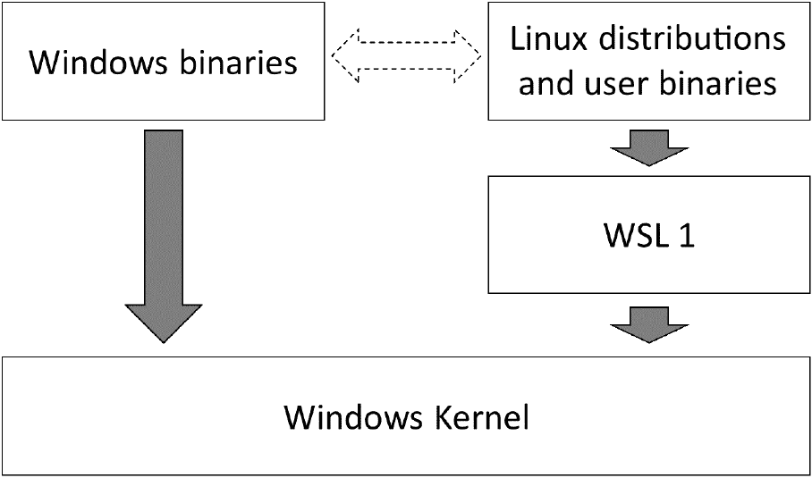
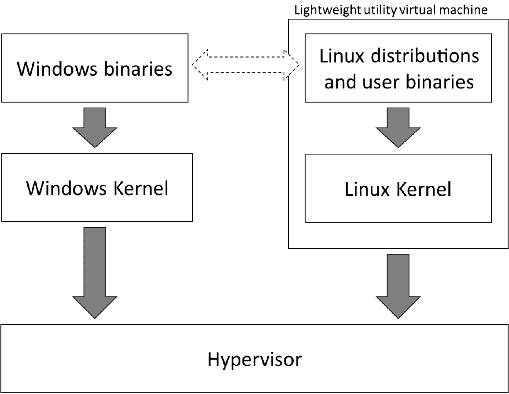

# 一、Linux 下的 Windows 子系统简介

在这一章,你将学习一些用例的**Windows 子系统为 Linux**(**WSL**),开始了解 WSL 实际上是什么,以及它如何比较运行 Linux 虚拟机。 这将帮助我们理解本书的其余部分，在这些部分中，我们将学习有关 wsdl 的所有知识，以及如何安装和配置它，同时还将学到一些技巧，以便为您的开发人员工作流最大限度地利用它。

使用 WSL，您可以在 Windows 上运行 Linux 实用程序来帮助完成工作。 您可以使用本机 Linux 工具(如**调试器**)构建 Linux 应用，从而打开一个只有基于 Linux 的构建系统的项目世界。 这些项目中有许多也会生成 Windows 二进制文件作为输出，但 Windows 开发人员很难访问和贡献。 但是，由于 WSL 为您提供了 Windows 和 Linux 的结合功能，您可以完成所有这些工作，同时仍然将您最喜欢的 Windows 实用程序作为流程的一部分。

这本书的重点是 WSL 的版本 2，它是对该特性的重大修改，本章将概述该版本如何工作，以及与版本 1 的比较。

在本章中，我们将特别涵盖以下主题:

*   WSL 是什么?
*   探索 WSL 1 和 WSL 2 之间的差异

因此，让我们从定义 wsdl 开始吧!

# 什么是 WSL?

在较高的级别上，WSL 提供了在 Windows 上运行 Linux 二进制文件的能力。 运行 Linux 二进制文件的愿望已经存在很多年了，至少在中已经存在了**Cygwin**([https://cygwin.com](https://cygwin.com))这样的项目。 根据其主页，Cygwin 是*“一个 GNU 和开源工具的大集合，它提供了类似于 Windows 上的 Linux 发行版*的功能。 要在 Cygwin 上运行 Linux 应用，需要从源代码重新构建。 wsdl 提供了在 Windows 上运行 Linux 二进制文件而无需修改的能力。 这意味着您可以获取您最喜欢的应用的最新版本并立即使用它。

想要在 Windows 上运行 Linux 应用的原因是多种多样的，包括以下几点:

*   您目前正在使用 Windows，但对 Linux 应用和实用程序有经验和熟悉。
*   您在 Windows 上进行开发，但将应用部署的目标定位于 Linux(直接或在容器中)。
*   您使用的是开发人员栈，其中生态系统在 Linux 上有更强的存在，例如 Python，其中一些库是特定于 Linux 的。

无论您为什么想在 Windows 上运行 Linux 应用，WSL 都为您带来了这种能力，并以一种新的、高效的方式实现了这一点。 虽然在 Hyper-V 中运行 Linux**虚拟机**(**VM**)已经有可能很长一段时间了，但运行 VM 会给您的工作流带来一些障碍。

例如，启动一个 VM 需要足够的时间来让您失去思维流，并且需要主机上的专用内存。 此外，虚拟机中的文件系统是专用于该虚拟机的，并且与主机隔离。 这意味着在 Windows 主机和 Linux 虚拟机之间访问文件需要为 Guest Integration Services 设置 Hyper-V 特性或设置传统的网络文件共享。 VM 的隔离还意味着 VM 内部和外部的进程无法方便地相互通信。 基本上，在任何时间点，您要么在 VM 中工作，要么在 VM 之外工作。

当您第一次使用 WSL 启动终端时，您在 Windows 中有一个运行 Linux shell 的终端应用。 与 VM 体验相比，这个看似简单的差异已经更好地集成到工作流中，因为在同一台机器上的 windows 之间切换比在 windows 上的应用和 VM 会话中的应用之间切换更容易。

然而，在 WSL 中集成 Windows 和 Linux 环境的工作走得更远。 虽然文件系统是在 VM 中设计隔离的，但是默认情况下为您配置了 WSL 文件系统访问。 在 Windows 中，您可以访问一个新的`\\wsl$\`网络文件共享，当 WSL 运行时，它将自动为您提供对 Linux 文件系统的访问。 在 Linux 中，您的本地 Windows 驱动器默认会自动挂载。 例如，Windows`C:`驱动器被挂载为`/mnt/c`。

更令人印象深刻的是，您可以从 Windows 调用 Linux 中的进程，反之亦然。 例如，作为 wsdl 中的 Bash 脚本的一部分，您可以调用 Windows 应用，并通过管道将该应用输出到另一个命令来处理该应用在 Linux 中的输出，就像使用本机 Linux 应用一样。

这种集成超出了传统 vm 所能实现的范围，并为将 Windows 和 Linux 的功能集成到一个单一的、高效的环境中创造了一些惊人的机会，可以让您获得两个世界的最佳效果!

使用 WSL 在 Windows 主机和 Linux VM 环境之间实现的集成令人印象深刻。 然而，如果您已经使用过 WSL 1 或者熟悉它的工作方式，那么您可能已经阅读了前面的段落，并且想知道为什么 WSL 2 从以前的体系结构中移走了，因为以前的体系结构不使用 VM。 在下一节中，我们将简要地看一下 WSL 1 和 WSL 2 之间的不同架构，以及尽管 WSL 团队在创建我们刚才看到的集成级别时面临着额外的挑战，但是使用 VM 可以解开什么问题。

# 探索 WSL 1 和 WSL 2 之间的差异

虽然这本书讨论了 Linux(**WSL 2**)的**Windows 子系统的版本 2，但是简要地看看版本 1 (WSL 1)是如何工作的是很有帮助的。 这将帮助您理解 WSL 1 的局限性，并为在 WSL 2 中体系结构的变化以及由此产生的新功能提供上下文。 这就是本节将要讨论的内容，在此之后，本书的其余部分将重点讨论 WSL 2。**

## WSL 概述

在 WSL 的第一个版本中，WSL 团队在 Linux 和 Windows 之间创建了一个翻译层。 这一层实现了**Linux 系统调用**在 Windows 内核的之上，它使 Linux 二进制文件无需修改即可运行; 当 Linux 二进制程序运行并进行系统调用时，它调用的是 WSL 转换层，并将其转换为对 Windows 内核的调用。 如下图所示:

图 1.1 -显示 WSL 1 翻译层的大纲

除了转换层之外，还进行了一些投资以支持其他功能，如 Windows 和 WSL 之间的文件访问以及在两个系统之间调用二进制文件(包括捕获输出)的能力。 这些功能有助于构建特性的整体丰富性。

在 WSL 1 中创建翻译层是一个大胆的举动，并在 Windows 上开辟了新的可能性，然而，并不是所有的 Linux 系统调用都实现了，Linux 二进制文件只有在它们需要的所有系统调用都实现了的情况下才能运行。 幸运的是，*被*实现的系统调用允许运行范围广泛的应用，例如**Python**和**Node.js**。

翻译层负责连接 Linux 和 Windows 内核之间的鸿沟，这带来了一些挑战。 在某些情况下，桥接这些差异会增加性能开销。 在 WSL 1 上执行大量文件访问的应用运行速度明显变慢; 例如，由于在 Linux 和 Windows 世界之间进行转换的开销。

在其他情况下，Linux 和 Windows 之间的差异更深，很难看到如何协调它们。 例如，在 Windows 上，当目录中包含的文件被打开时，试图重命名该目录会导致错误，而在 Linux 上，重命名可以成功执行。 在这种情况下，很难看出翻译层是如何解决差异的。 这导致一些系统调用没有被实现，从而导致一些 Linux 应用不能在 WSL 1 上运行。 下一节将介绍在 WSL 2 中所做的更改，以及它们如何应对这一挑战。

## WSL 2 概述

与 WSL 1 翻译层一样令人印象深刻的是一项壮举，但它总是会遇到性能挑战和难以或不可能正确实现的系统调用。 对于 WSL 2, WSL 团队回到图纸板，并提出了一个新的解决方案:**虚拟机**! 这种方法通过运行 Linux 内核来避免 wsdl 1 的转换层:

图 1.2 -显示 WSL 2 体系结构的大纲

当您想到虚拟机时，您可能会认为它启动很慢(至少与启动 shell 提示符相比)，在启动时占用很大的内存，并且与主机隔离运行。 从表面上看，在 WSL 1 中把两个环境结合在一起的工作完成之后，对 WSL 2 使用虚拟化似乎有些出人意料。 事实上，运行 Linux VM 的能力在 Windows 上早就存在了。 那么，是什么使 wsdl 2 不同于运行虚拟机呢?

文档中提到的**轻量级实用程序虚拟机**的使用(见[https://docs.microsoft.com/en-us/windows/wsl/wsl2-about](https://docs.microsoft.com/en-us/windows/wsl/wsl2-about))带来了的巨大差异。 该虚拟机启动速度很快，只消耗少量内存。 当您运行需要内存的进程时，虚拟机会动态地增加它的内存使用量。 更好的是，当内存在虚拟机中释放时，它会返回给主机!

为 WSL2 运行虚拟机意味着它现在正在运行 Linux 内核(它的源代码可以在[https://github.com/microsoft/WSL2-Linux-Kernel](https://github.com/microsoft/WSL2-Linux-Kernel)上找到)。 这又意味着消除了 WSL 1 转换层所面临的挑战:在 WSL 2 中性能和系统调用兼容性都得到了极大的改进。

将与保留 WSL 1 (Windows 和 Linux 之间的互操作性)的整体体验的工作结合起来，WSL 2 为大多数场景提供了积极的进步。

对于大多数用例，出于兼容性和性能的考虑，wsdl 2 将是首选版本，但有几件事值得注意。 其中一个是,(在撰写本文时)的一般可用版本 WSL 2 不支持 GPU 或 USB 访问(详情[https://docs.microsoft.com/en-us/windows/wsl/wsl2-faq can-i-access-the-gpu-in-wsl-2-are-there-plans-to-increase-hardware-support](https://docs.microsoft.com/en-us/windows/wsl/wsl2-faq#can-i-access-the-gpu-in-wsl-2-are-there-plans-to-increase-hardware-support))。 GPU 支持是在 2020 年 5 月的*Build*会议上宣布的，在撰写本文时可以通过 Windows Insiders Program([https://insider.windows.com/en-us/](https://insider.windows.com/en-us/))获得。

另一个需要考虑的问题是，由于 WSL 2 使用虚拟机，在 WSL 2 中运行的应用将通过与主机(主机具有单独的 IP 地址)分开的网络适配器连接到网络。 正如我们将在[*第五章*](05.html#_idTextAnchor054)，*Linux 到 Windows 的互操作性中看到的，*WSL 团队已经在网络互操作性方面进行了投资，以帮助减少这一问题的影响。

幸运的是，WSL 1 和 WSL 2 可以同时运行，所以如果您有一个需要 WSL 1 的特定场景，那么您可以使用它来完成该场景，并继续使用 WSL 2 来完成其他场景。

# 总结

在本章中，您看到了什么是 WSL，以及它通过允许跨 Windows 和 Linux 环境的文件系统和进程之间的集成而与传统 VM 的体验有何不同。 您还概述了 WSL 1 和 WSL 2 之间的差异，以及为什么在大多数情况下，性能和兼容性的改进使 WSL 2 成为首选选项。

在下一章中，您将学习如何安装和配置 wsdl 和 Linux 发行版。