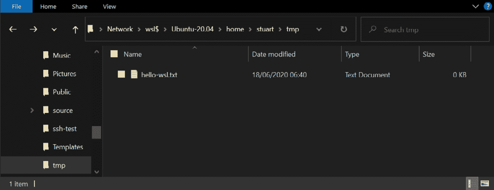
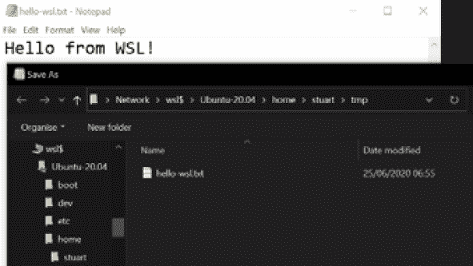

# *第四章*:Windows 到 Linux 的互操作性

在[*第一章*](01.html#_idTextAnchor017)、*Windows 子系统介绍*中，我们将 WSL 的经验与在虚拟机上运行 Linux 进行了比较; 在虚拟机专注于隔离的地方，WSL 在 Windows 和 Linux 之间内置了很强的互操作性。 在本章中，您将开始了解这些功能，从与在 WSL 下运行的文件和应用程序以及来自 Windows 主机环境的文件进行交互开始。 这将包括研究如何在运行在 Windows 和 wsdl 中的脚本之间管道输出。 在此之后，我们将看看 wsdl 如何使 Linux 中的 web 应用程序能够从 Windows 访问。

在本章中，我们将涵盖以下主要主题:

*   从 Windows 访问 Linux 文件
*   从 Windows 运行 Linux 应用程序
*   从 Windows 访问 Linux web 应用程序

让我们开始吧!

# 从 Windows 访问 Linux 文件

当安装了WSL 后，会得到一个新的`\\wsl$`路径，可以在 Windows 资源管理器和其他程序中寻址。 如果你在 Windows 资源管理器的地址栏中输入`\\wsl$`，它会列出任何正在运行的 Linux**发行版**(**发行版**)，如下截图所示:


图 4.1 -在 Windows Explorer 中显示\\wls$的截图

正如你在前面的截图中看到的，每个运行的发行版都显示为`\\wsl$`下的路径。 每个`\\wsl$\<distroname>`是`<distroname>`的文件系统根目录的路径。 例如，`\\wsl$\Ubuntu-20.04`是用于从 Windows 访问`Ubuntu-20.04`发行版的文件系统根目录的 Windows 路径。 这是一个非常灵活和强大的功能，可以将 Linux 发行版的文件系统完全访问到 Windows。

下面的屏幕截图显示了 Windows 资源管理器中的`\\wsl$\Ubuntu-20.04\home\stuart\tmp`路径。 这对应于`Ubuntu-20.04`发行版中的`~/tmp`文件夹:



图 4.2 -在 Windows 资源管理器中显示 Linux 发行版内容的屏幕截图

在这些屏幕截图中，您可以在 Windows 资源管理器中看到 Linux 文件系统，但是这些路径可以被任何接受 UNC 路径(即以`\\`开始的路径)的应用程序使用。 例如，在 PowerShell 中，你可以像在 Windows 中一样从 Linux 文件系统中读写:

```sh
C:\ > Get-Content '\\wsl$\ubuntu-20.04\home\stuart\tmp\hello-wsl.txt'
Hello from WSL!
C:\ >
```

在本例中，在 Ubuntu 20.04 发行版中创建了一个文本文件`~/tmp/hello-wsl.txt`，其中包含`Hello from WSL!`内容，并且使用`Get-Content`PowerShell cmdlet 读取文件的内容，使用我们前面看到的`\\wsl$\...`路径。

当您在 Windows 资源管理器中浏览文件系统时，双击文件上的将尝试在 Windows 中打开它。 例如，双击我们在*图 4.2*中查看的文本文件，将在默认的文本编辑器中打开它(在我的例子中是记事本)，如下截图所示:



图 4.3 -在记事本中打开 Linux 文件的屏幕截图

这个屏幕截图显示的内容与前面通过 PowerShell 获取文件内容的示例相同，但在记事本中打开。 打开“**另存为**”对话框，显示`\\wsl$\...`路径。

提示

如果你浏览`\\wsl$`没有看到你安装的某个发行版，那么这就表明这个发行版没有运行。

启动发行版的一个简单方法是使用 Windows Terminal 在其中启动一个 shell。 或者，如果您知道发行版的名称，您可以在 Windows 资源管理器地址栏(或您正在使用的任何应用程序)中键入`\\wsl$\<distroname>`，然后 WSL 将自动启动发行版，允许您浏览文件系统!

正如您在本节中看到的，`\\wsl$\`共享提供了从 Windows 应用程序访问 WSL 发行版文件系统中的文件的能力。 这是连接 Windows 和 Linux 与 WSL 的一个有用步骤，因为它允许您使用 Windows 工具和应用程序来处理 Linux 文件系统中的文件。

接下来，我们将看看在 Windows 中以 WSL 运行应用程序。

# 从 Windows 运行 Linux 应用程序

在第二章[*【4】【5】,*安装和配置 Windows 子系统为 Linux*,你简要介绍了`wsl`命令,你看到它可以连续控制【显示】发行版和执行应用程序内部发行版。 在本节中，我们将深入研究使用`wsl`命令在发行版中运行应用程序。*](02.html#_idTextAnchor023)

正如我们在上一节中看到的，能够跨 Windows 和 Linux 访问文件是非常有用的，并且能够在此基础上进一步调用应用程序。 wsdl 不仅仅能够在 Windows 发行版中运行应用程序，它还允许在应用程序之间通过管道输出。 在 Windows 或 Linux 中构建脚本时，在应用程序之间使用管道输出是构建脚本功能的一种非常常见的方法。 能够在 Windows 和 Linux 命令之间管道输出，允许您构建在 Windows*和*Linux 上运行的脚本，这确实有助于构建将这两个环境结合起来的感觉。 接下来我们将开始研究它是如何工作的。

## 管道到 Linux

在本节中，我们将探索从 Linux 到 Windows 的管道数据。 I多次遇到的一个场景是，有一些数据(如日志输出)，我想对它们执行一些处理。 这方面的一个例子是处理每一行以提取 HTTP 状态代码，然后分组并计数以计算记录了多少成功与失败。 我们将使用一个示例来代表这个场景，但不需要任何实际的设置:我们将检查 Windows 目录中的文件，并确定有多少个以每个字母开头的文件。

让我们从一些 PowerShell 开始(我们将构建脚本，所以如果你不完全熟悉 PowerShell，不要担心):

1.  First of all, we will use `Get-ChildItem` to get the contents of the `Windows` folder as shown in the following command:

    ```sh
    PS C:\> Get-Childitem $env:SystemRoot
     Directory: C:\Windows
    Mode                 LastWriteTime         Length Name
    ----                 -------------         ------ ----
    d----          07/12/2019    14:46                addins
    d----          01/05/2020    04:44              appcompat
    d----          17/06/2020    06:11               apppatch
    d----          27/06/2020    06:36           AppReadiness
    d-r--          13/05/2020    19:45                assembl
    d----          17/06/2020    06:11               bcastdvr
    d----          07/12/2019    09:31                Boot
    d----          07/12/2019    09:14               Branding
    d----          14/06/2020    07:31               CbsTemp
    ... (output truncated!)
    ```

    在这个命令中，我们使用`SystemRoot`环境变量来引用`Windows`文件夹(通常是`C:\Windows`)，以防您已经定制了安装位置。 输出显示了来自`Windows`文件夹的一些文件和文件夹，您可以看到每个项目的各种属性，如`LastWriteTime`、`Length`和`Name`。

2.  Next, we can perform the extraction, in this case taking the first letter of the filename. We can add to our previous command by piping the output from `Get-ChildItem` into the `ForEach-Object` cmdlet as shown here:

    ```sh
    PS C:\> Get-Childitem $env:SystemRoot | ForEach-Object { $_.Name.Substring(0,1).ToUpper() }
    A
    A
    A
    A
    A
    B
    B
    B
    C
    C
    C
    ```

    这个输出显示了`ForEach-Object`的结果，它接受输入(`$_`)并使用`Substring`获得第一个字符，这让您获得字符串的一部分。 `Substring`的第一个参数指定从哪里开始(`0`表示字符串的开始)，第二个参数是要接受多少个字符。 前面的输出显示，一些文件和文件夹以小写开头，而另一些以大写开头，因此我们调用`ToUpper`来标准化使用大写。

3.  The next step is to group and count the items. Since the goal is to demonstrate piping output between Windows and Linux, we'll ignore the PowerShell `Group-Object` cmdlet for now and instead use some common Linux utilities: `sort` and `uniq`. If you were using these commands in Linux with some other output, you could pipe that into them as `other-command | sort | uniq -c`. However, since `sort` and `uniq` are Linux commands and we're running this from Windows, we need to use the `wsl` command to run them as shown in the following output:

    ```sh
    PS C:\> Get-Childitem $env:SystemRoot | ForEach-Object { $_.Name.Substring(0,1).ToUpper() } | wsl sort | wsl uniq -c 
     5 A
     5 B
     5 C
     9 D
     3 E
     2 F
    ...
    ```

    前面的输出显示了我们的目标结果:以每个字母开头的文件和文件夹的数量。 但更重要的是，它显示了将输出从 Windows 命令管道到 Linux 命令的工作原理!

在这个示例中，我们调用了两次`wsl`:一次用于`sort`，一次用于`uniq`，这将导致输出在管道中的每个阶段在 Windows 和 Linux 之间通过管道传递。 如果我们稍微改变一下命令的结构，我们可以使用单个`wsl`调用。 尝试将输入管道导入`wsl sort | uniq -c`可能很诱人，但这将试图将`wsl sort`的输出管道导入 Windows`uniq`命令。 您也可以考虑`wsl "sort | uniq -c"`，但它与错误`/bin/bash: sort | uniq -c: command not found`一起失败。 相反，我们可以使用`wsl`与我们的命令`wsl bash -c "sort | uniq -c"`一起运行`bash`。 full 命令如下:

```sh
PS C:\> Get-Childitem $env:SystemRoot | ForEach-Object { $_.Name.Substring(0,1).ToUpper() } | wsl bash -c "sort | uniq -c"

      5 A
      5 B
      5 C
      9 D
      3 E
      2 F
...
```

如您所见，这将提供与前一个版本相同的输出，但只执行了`wsl`的一次。 虽然这可能不是运行复杂的命令的最明显的方法，但它是一种有用的技术。

在本例中，我们关注的是将数据管道导入 Linux，但是当管道从 Linux 命令输出时，它也同样工作得很好，下面我们将看到。

## 来自 Linux 的管道

在前面的部分中,我们看着从 Windows 命令管道输出到Linux,并探索通过使用 PowerShell 检索项`Windows`文件夹,把他们的首字母传递给 Linux 实用程序类之前,集团和计数。 在本节中，我们将研究从 Linux 实用程序到 Windows 的管道输出。 我们将使用相反的示例，即通过 Bash 列出文件并使用 Windows 实用程序处理输出。

首先，让我们从默认发行版的`/usr/bin`文件夹中获取文件和文件夹:

```sh
PS C:\> wsl ls /usr/bin
 2to3-2.7                             padsp
 GET                                  pager
 HEAD                                 pamon
 JSONStream                           paperconf
 NF                                   paplay
 POST                                 parec
 Thunar                               parecord
...
```

该输出显示了`/usr/bin`文件夹的内容，下一步是取名称的第一个字符。 为此，我们可以使用`cut`命令。 我们可以运行`wsl ls /usr/bin | wsl cut -c1`，但我们可以重用上一节中看到的技术，将其合并为单个`wsl`命令:

```sh
PS C:\> wsl bash -c "ls /usr/bin | cut -c1"
2
G
H
J
N
P
T
```

正如您从前面的输出中看到的，我们现在只有第一个字符，并且已经准备好对它们进行排序和分组。 在这个练习中，我们假设`sort`和`uniq`命令不存在，我们将使用 PowerShell`Group-Object`cmdlet:

```sh
PS C:\> wsl bash -c "ls /usr/bin | cut -c1-1" | Group-Object
Count Name                      Group
----- ----                      -----
    1 [                         {[}
    1 2                         {2}
   46 a                         {a, a, a, a…}
   79 b                         {b, b, b, b…}
   82 c                         {c, c, c, c…}
   79 d                         {d, d, d, d…}
   28 e                         {e, e, e, e…}
   49 f                         {f, f, f, f…}
  122 G                         {G, g, g, g…}
```

在这里，我们可以看到输出成功地通过管道从以 WSL 运行的 Bash 命令传输到 PowerShell`Group-Object`cmdlet。 在上一节中，我们强制字符大写，但这里不需要这样做，因为`Group-Object`在默认情况下执行不区分大小写的匹配(尽管可以用`-CaseSensitive`开关覆盖)。

正如您在这些示例中看到的，您使用 wsdl 调用 Linux 发行版来执行 Linux 应用程序和实用程序。 这些示例只是使用了默认的 WSL 发行版，但是在上面的所有示例中，您可以在`wsl`命令上添加`-d`开关，以指定在哪个发行版中运行 Linux 命令。 如果您有多个发行版，并且您需要的特定应用程序只在其中一个发行版中可用，那么这将非常有用。

能够在 Windows 和 Linux 应用程序之间任意方向传输输出，在组合应用程序时可以提供很大的灵活性。 如果您更熟悉 Windows 实用程序，您可能会执行 Linux 应用程序，然后使用 Windows 实用程序处理结果。 或者如果 Linux 是您比较熟悉的地方，但您需要在 Windows 机器上工作，那么能够调用熟悉的 Linux 实用程序来处理 Windows 输出将帮助您提高工作效率。

您已经了解了如何从 Windows 访问 Linux 文件和从 Windows 调用 Linux 应用程序。 在下一节中，您将看到如何从 Windows 访问以 WSL 运行的 web 应用程序。

# 从 Windows 访问 Linux web 应用

如果你正在开发一个 web 应用程序，那么你通常会在你的 web 浏览器中以`http://localhost`的形式打开你的应用程序。 使用 WSL，您的 web 应用程序在 WSL 轻量级虚拟机中运行，该虚拟机有一个单独的 IP 地址(您可以通过 Linux`ip addr`命令找到该 IP 地址)。 幸运的是，WSL 将本地主机地址转发给 Linux 发行版，以保持自然的工作流。 您将在本节中完成。

跟随本,确保你有这本书的代码克隆一个 Linux 发行版,打开终端,并导航到 https://github.com/PacktPublishing/Windows-Subsystem-for-Linux-2-WSL-2-Tips-Tricks-and-Techniques/tree/main/chapter-04[的`chapter-04/web-app`文件夹](https://github.com/PacktPublishing/Windows-Subsystem-for-Linux-2-WSL-2-Tips-Tricks-and-Techniques/tree/main/chapter-04)。

示例代码使用 Python 3，如果您使用的是最新版本的 Ubuntu，那么应该已经安装了 Python 3。 您可以通过在您的 Linux 发行版中运行`python3 -c 'print("hello")'`来测试是否安装了 Python 3。 如果命令成功完成，则一切就绪。 如果没有，请参考 Python 文档中的安装说明:[https://wiki.python.org/moin/BeginnersGuide/Download](https://wiki.python.org/moin/BeginnersGuide/Download)。

在`chapter-04/web-app`文件夹中，您应该看到`index.html`和`run.sh`。 在终端中，运行`./run.sh`运行 web 服务器:

```sh
$ ./run.sh
Serving HTTP on 0.0.0.0 port 8080 (http://0.0.0.0:8080/) ... 
```

您应该看到类似于前面输出的输出，表明 web 服务器正在运行。

您可以通过在您的 Linux 发行版中启动一个新终端并运行`curl`来验证 web服务器正在运行:

```sh
$ curl localhost:8080
<!DOCTYPE html>
<html lang="en">
<head>
    <meta charset="UTF-8">
    <meta name="viewport" content="width=device-width, initial-scale=1.0">
    <title>Chapter 4</title>
</head>
<body>
    <h1>Hello from WSL</h1>
    <p>This content is brought to you by python <a href="https://docs.python.org/3/library/http.server.html">http.server</a> from WSL.</p>
</body>
</html>
$
```

这个输出显示了 web 服务器响应`curl`请求所返回的 HTML。

接下来，在 Windows 中打开你的网页浏览器并导航到`http://localhost:8080`:


图 4.4 -在 Windows 浏览器中显示 WSL web 应用程序的屏幕截图

如前面的截图所示，WSL 将 Windows 中**localhost**的流量转发到 Linux 发行版中。 当你使用 WSL 开发一个 web 应用程序或使用 web 用户界面运行应用程序时，你可以使用**localhost**访问 web 应用程序，就像它在 Windows 本地运行一样; 这是另一个真正平滑用户体验的集成。

# 总结

在本章中，您已经看到了 wsdl 允许我们从 Windows 与 Linux 发行版互操作的方式，从通过`\\wsl$\...`路径访问 Linux 文件系统开始。 您还了解了如何从 Windows 调用 Linux 应用程序，以及可以通过管道将 Windows 和 Linux 命令连接在一起，就像在两个系统中通常做的那样。 最后，您看到 WSL 将**localhost**请求转发到运行在 WSL 发行版内部的 web 服务器。 这使得您可以轻松地在 WSL 中开发和运行 web 应用程序，并在 Windows 的浏览器中测试它们。

能够从 Windows 访问 WSL 发行版的文件系统并在其中执行命令，确实有助于将这两个系统结合在一起，并帮助您为正在处理的任务选择首选工具，而不管它们在哪个操作系统中。 在下一章中，我们将探讨在 WSL 发行版中与 Windows 交互的能力。